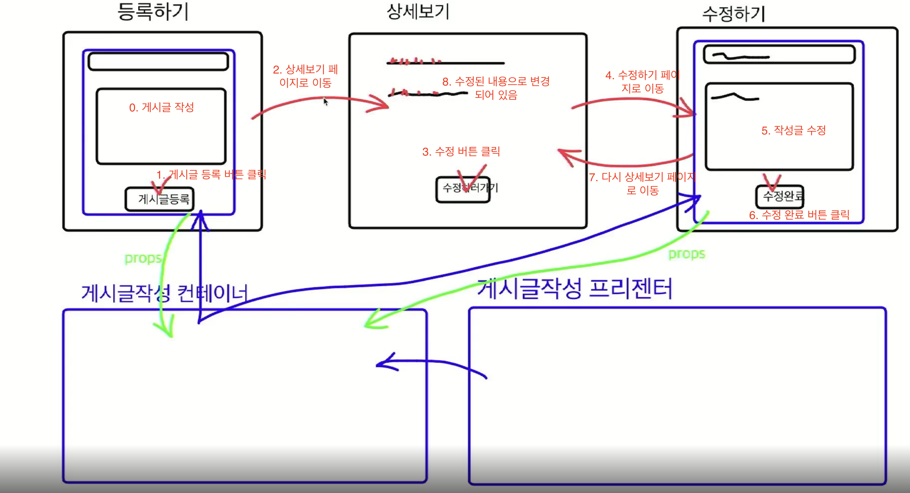

2차에 걸쳐서 수정페이지를 만들텐데 1차는 간단한 방법으로 진행

페이지 이동 로직의 흐름은 다음과 같다

등록하기 페이지 -> boards/new
상세보기 페이지 -> boards/[number]
수정하기 페이지 -> boards/[number]/edit

========================================    

현재의 문제점은

localhost:3000/section09/09-03-boards/[number]edit

에서 다시 수정을 하러 갔을때

작성자의 이전값이 보이지 않는 문제가 있다.

==========================================

수정할때 제목만 바꾸게되면 작성자랑 내용이 빈칸으로 변하는 버그가 존재

